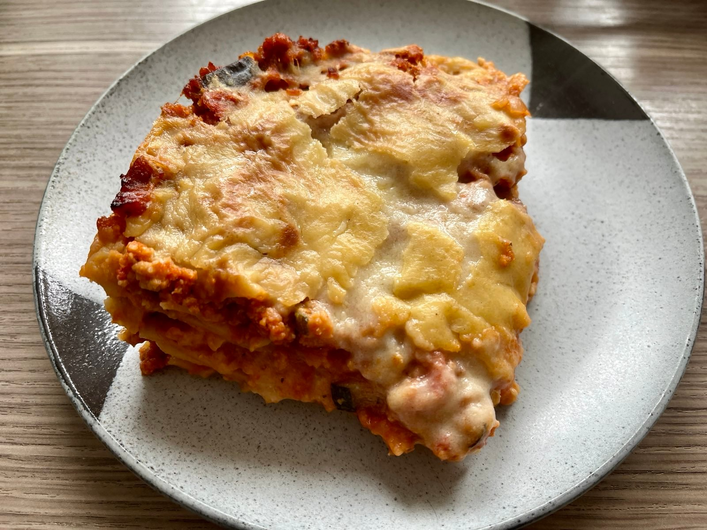
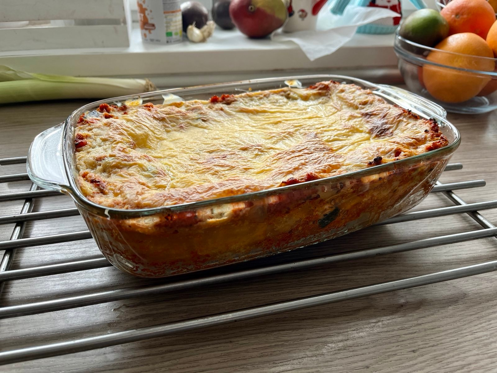

Oh but lasagna, what a dish! One of those recipes that makes you forget everything and just enjoy it. I must say, that is disappears very quickly. This is an adaptation of the exquisite [avantgardevegan](https://www.gazoakleychef.com/recipes/lasagne/) recipe, but with more mushrooms and smaller measurements. Turned out great!

I made the ragu a day in advance and apart from making this dish a bit less daunting, it also allowed the flavors to mingle a bit better I think. The bechamel is quite quick to make, but you could also infuse the milk in advance.

Slice - Side view

Prep time: 30 minutes

Cooking time: 1 hour

### Ingredients for 1 tray (~8 servings)
#### For the ragu
- [ ] 1 large red onion, chopped
- [ ] 3 cloves of garlic, minced
- [ ] 1 medium zuccini, ~1cm cubes
- [ ] 1/2 medium eggplant, ~1cm cubes
- [ ] 1 cup finely chopped mushrooms (I've used champignon)
- [ ] 1 large stick of celery, finely chopped
- [ ] 2 tbsp olive oil
- [ ] 2 cans of chopped tomatoes
- [ ] 1 tbsp tomato paste
- [ ] 200g vegan mince (I've used a soy-based one)
- [ ] 1 tbsp mixed italian herbs

#### For the bechamel
- [ ] 90g vegan butter
- [ ] 50g flour
- [ ] 0.75l soy milk
- [ ] 1 onion, peeled and cut into 8
- [ ] 1 bay leaf
- [ ] 1 tsp salt
- [ ] 1/2 tsp nutmeg
- [ ] 100g grated vegan cheese (I've used a soy-based one)
- [ ] 2 tbsp nutritional yeast

#### Pasta
- [ ] 1/2 pack of lasagna sheets

### Steps
1. In a medium pot, add your milk and boil it with the onion, bay leaf, salt and nutmeg. Once it boils, turn off the heat and let it sit for 10 minutes. Strain the milk and set aside.
2. In a large pot, add the olive oil and saute the onion and celery. Once they are soft, add the garlic and saute for 1 minute.
3. Add the zucchini, eggplant and mushrooms and saute for 5 minutes until the vegetables start to soften. Watch out for the bottom of the pot, you don't want it to burn.
4. Add the tomato paste and the canned tomatoes. Add the italian herbs and the vegan mince and stir well. Pour in a cup of water and let it simmer for at least 15 minutes. Add water as needed, but the ragu should be thick by the end.
5. In a medium pot on medium heat, melt the butter and add the flour. Stir well with a silicone spatula until it becomes a paste. Gradually add the milk and whisk rapidly until it thickens. Add the nutritional yeast and the grated cheese and stir well. Set aside.
6. Preheat the oven to 180C.
7. In a large tray, add a layer of ragu, then a layer of bechamel, then a layer of lasagna sheets. Repeat until you run out of ingredients. The top layer should be bechamel and ideally a bit thicker to be completely white.
8. Bake for 45 minutes, or until the top starts to brown. Let it cool for 10 minutes before serving.
9. For a clean cut, let it cool completely and then reheat it in the oven for 10 minutes.

