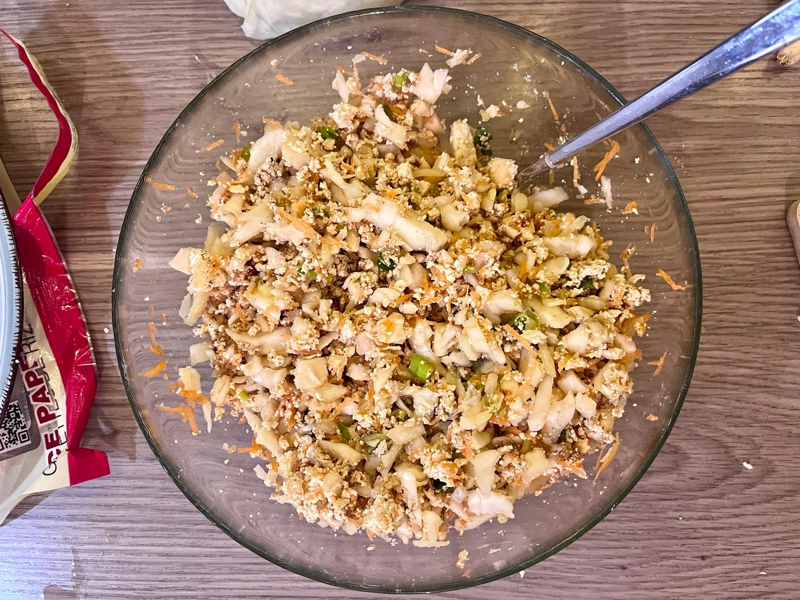

This recipe is brought to you by: The long shelf life of rice paper; Made by finally using up my old pack of partially shattered rice paper. Tasty rice paper dumplings, filled with a simple tofu & cabbage filling.

Now, I have picked up on the frowns of any Asian foodie, rice paper dumplings are somewhat of a sacrilege. But they taste nice and I think that's all that counts :)

Here is the shot of the filling — make sure to not overfill the dumplings, or they will break. Also, you want to chop the cabbage as finely as you can. These cook very quickly and you don't want raw cabbage!

## How to wrap
Here's a quick video on how to wrap these. You don't have to double wrap, but the risk of breakage is a lot higher. But I'm sure you won't be able to tell which of the 4 dumplings in the final photo are double wrapped.

<video width=100% controls loop muted playsinline class="video not-full-width">
    <source src="/videos/52CC3982-2200-4E6B-8349-FDE022245C15.webm" type="video/webm">
    Your browser does not support the video tag.
</video>
