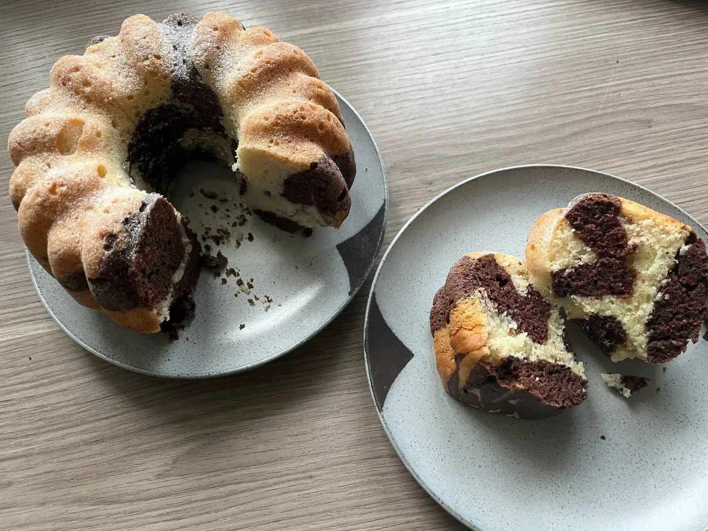
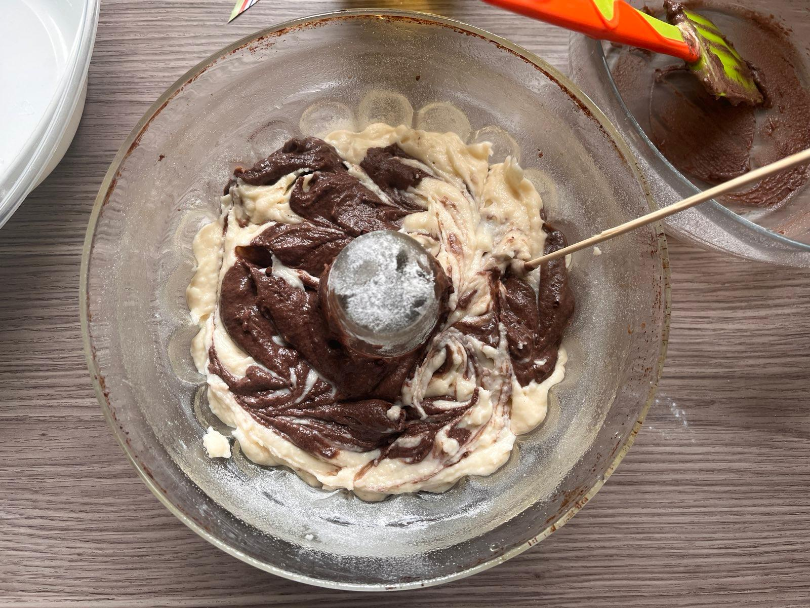

In my inevitable descent into becoming a housewife I have turned to the humble marble bundt cake. It's a fairly typical dessert to eat in the Czech Republic and I haven't had it in years. Hence, I present a recipe for this delicious staple of the mundane Sunday family occasion. Loosely inspired by [this recipe](https://web.archive.org/web/20230401104615/https://plantifulbakery.com/cs/vegan-mramorova-babovka/).

Final result - Marble effect

