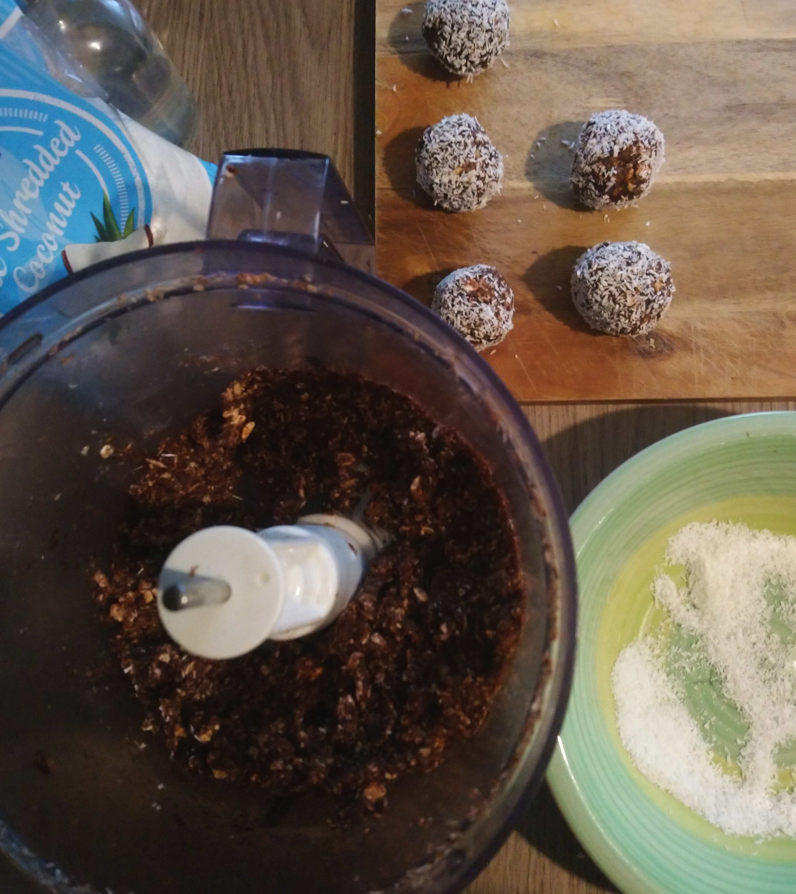
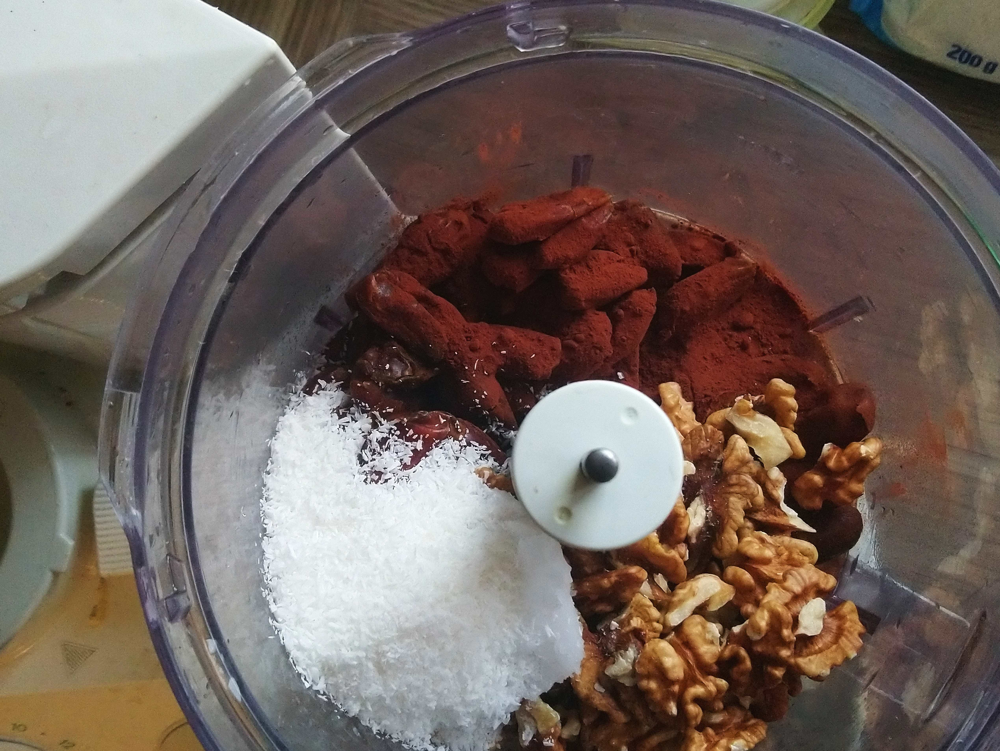

Christmas! We all know how dire the vegan Christmas
sweets situation is.
These balls are chewy, chocolatey, nutty and oh so good!

Ingredients intentionally vague, because nobody ever has enough walnuts.

They keep well in the fridge for a few weeks.

Christmas balls

