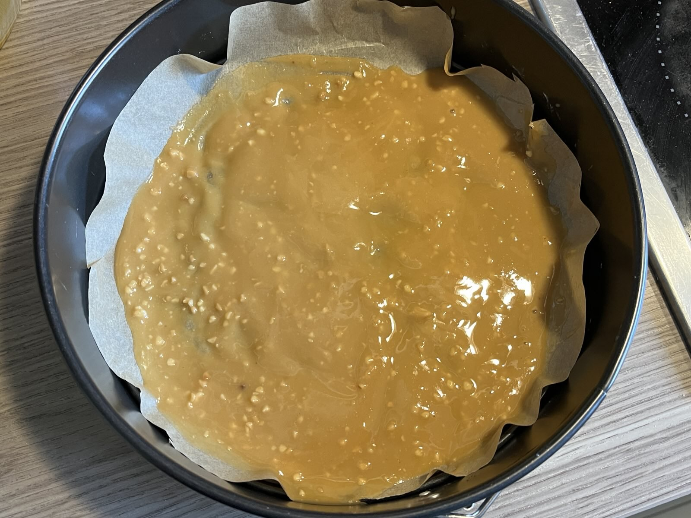
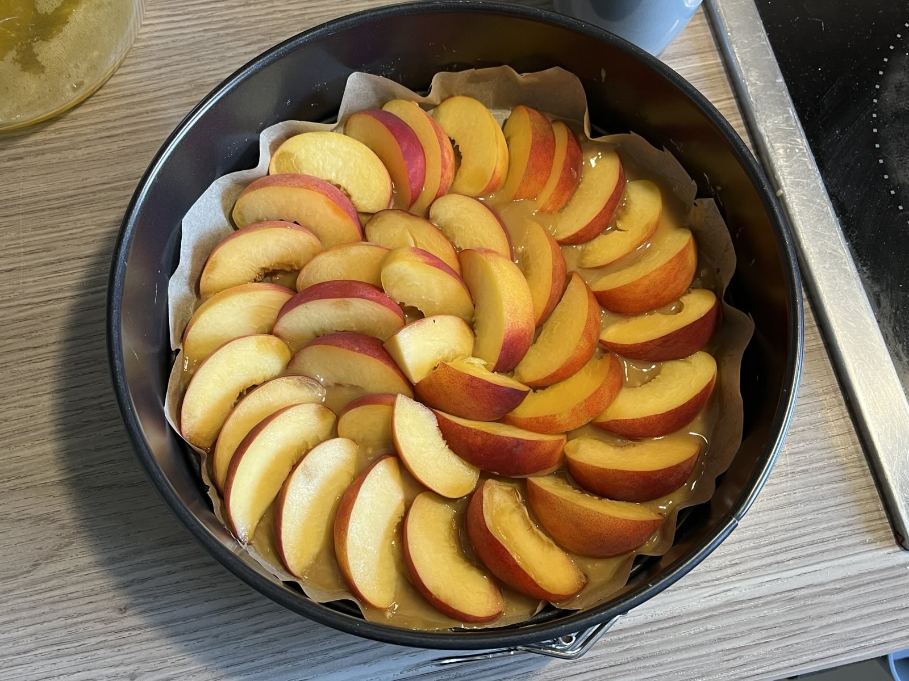

This is a cake that is baked with peaches at the bottom, and then inverted after baking. Every square centimeter of this cake hits you with a new flavor — the mixture of chocolate, peach and nuts is just unbelievable. Also, no sugar added here. If you want, you can even skip the chicory — it was still overly sweet for me, but I wanted to try it out :) Enjoy!

Final product

Here you can see how to arrange it. It might look like it will burn, but trust the process.

Base layer - Peach arrangement

