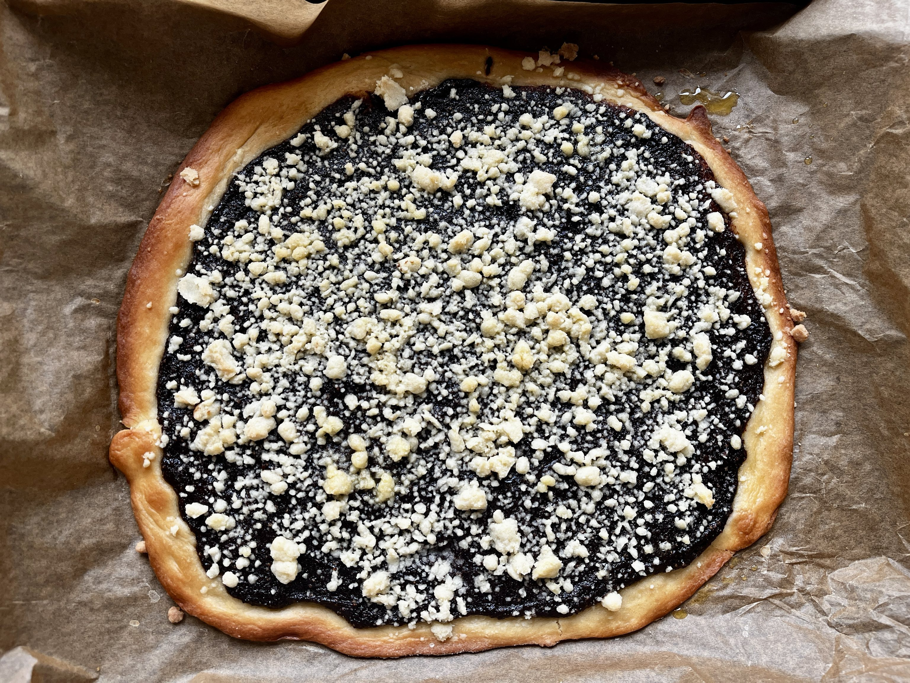
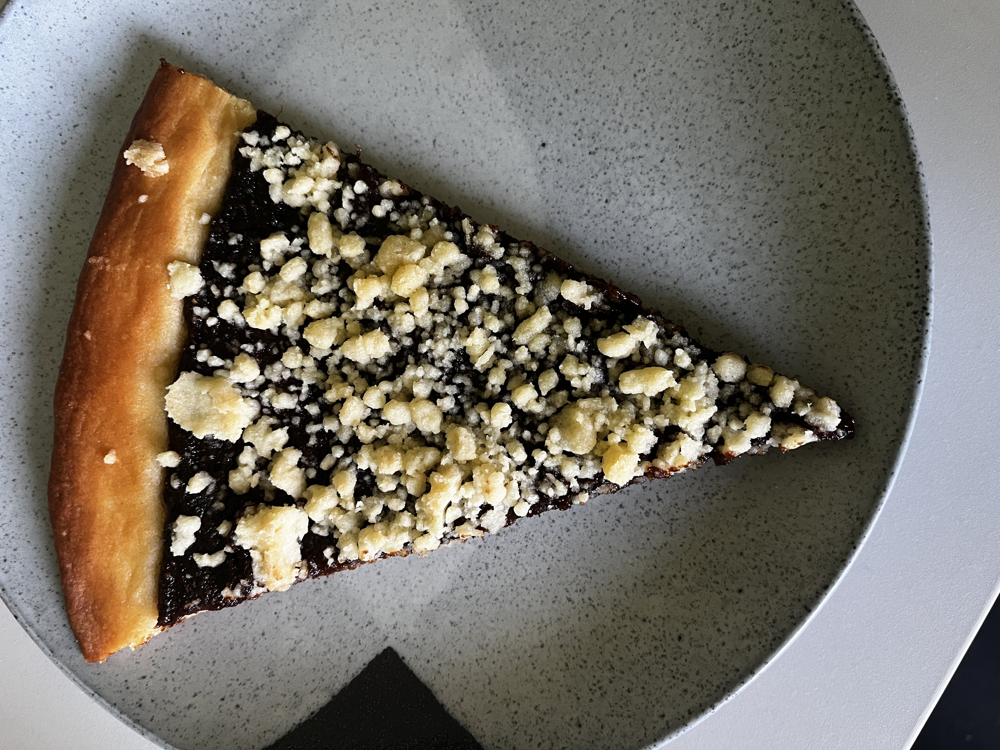

A traditional Czech pie that is close to my heart. It's not as hard to make as it may seem and it's quite a fun recipe. Sooo simple to make vegan too!

There is a variety of different fillings you can use — in this recipe I will show you how to make a plum jam version and a pear version. However, there is a host of other possible options and you can find them readily online.

*Tip: The dough can be quite sticky, so make sure to flour your hands and the surface you are working on.*

*Tip: Homemade jams vary in thickness and sweetness, adjust accordingly.*

<h3>Plum jam filling (1 frgál)</h3>

Prep time: 5 minutes

- 350g plum jam
- 1 packet vanilla sugar
- ~15g breadcrumbs
- optionally a splash of rum

Mix the jam with the vanilla sugar and rum. The filling should be only slightly runny and should spread without moving. If it's too runny, add breadcrumbs until it thickens.

<h3>Pear jam filling (1 frgál)</h3>

Prep time: 5 minutes

- 350g pear jam
- 1 packet vanilla sugar
- ~15g breadcrumbs
- optionally a splash of rum
- 1 tablespoon cinnamon
- 1 tablespoon ground star anise

Mix the jam with the vanilla sugar and rum. The filling should be only slightly runny and should spread without moving. If it's too runny, add breadcrumbs until it thickens.

Here are some more pictures 😉

Plum jam version | A single slice

